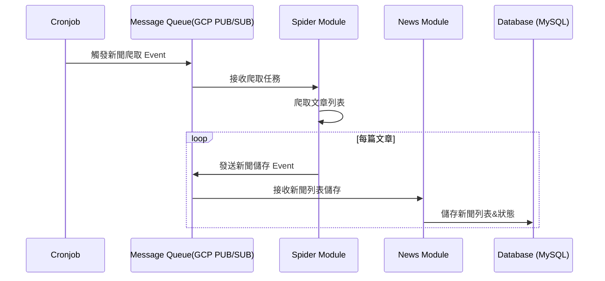

# tw-media-analytics

分析新聞標題,內容 , 並給予評分

## 功能特點
- 自動化新聞爬取與分析
- 支援多個新聞來源
- 使用 AI 模型進行新聞品質評分
- 即時新聞分析與評分
- 可擴展的新聞來源支援

## 技術架構
- 程式語言：Go
- 資料庫：MySQL
- ORM：GORM
- AI 模型：Google Gemini
- 爬蟲框架：Colly
- 訊息佇列：GCP Pub/Sub
- 日誌系統：Zerolog
- 監控系統：OpenTelemetry + Jaeger

## 安裝說明 (TODO)
<!-- 待補充：
1. 系統需求
2. 安裝步驟
3. 環境設定
-->

## 使用方式 (TODO)
<!-- 待補充：
1. 基本使用範例
2. 重要指令說明
3. 配置說明
-->

## 專案架構
```
--- domain <- Service modules are independently executable
 |
 --- Core Domain
 |
 --- Functional Modules
-- infra <- init function
main.go <- code init
```

## 工作流程

### 1. 新聞列表爬取流程


### 2. 新聞分析流程
<!-- ```mermaid
sequenceDiagram
    participant Cron as Cronjob
    participant MQ as Message Queue(GCP PUB/SUB)
    participant DB as Database (MySQL)
    participant AI as AI Model (Gemini)
    participant News as News moudle
    participant Analysis as Analysis moudle

    Cron->>News: 觸發取得未分析之新聞
    News->>Cron: 回傳未分析之新聞資料
    Cron->>MQ: 發送新聞分析Event 發送未分析之新聞資料
    MQ->>AI: 接收新聞分析任務
    Note over AI: 進行新聞分析
    AI->>MQ: 發送新聞分析儲存Event 發送新聞分析之結果
    Note over AI: 進行新聞分析儲存
    MQ->>Analysis: 接收新聞分析儲存任務
    Analysis->>DB: 儲存分析資料
``` -->

## 開發指南 (TODO)
<!-- 待補充：
1. 開發環境設置
2. 程式碼風格指南
3. 測試說明
4. 提交規範
-->

## 部署說明 (TODO)
<!-- 待補充：
1. 部署步驟
2. 部署注意事項
3. 環境檢查清單
-->

## 環境變數設定

### Server 設定
| 變數名稱     | 說明     | Type   | 可選值           | 預設值                     |
| ------------ | -------- | ------ | ---------------- | -------------------------- |
| SERVICE_NAME | 服務名稱 | string | -                | tw-media-analytics-service |
| ENV          | 執行環境 | string | local, dev, prod | dev                        |

### AI Model 設定
| 變數名稱       | 說明                   | Type   | 可選值 | 預設值 |
| -------------- | ---------------------- | ------ | ------ | ------ |
| GEMINI_API_KEY | Google Gemini API 金鑰 | string | -      | -      |

### GCP 設定
| 變數名稱       | 說明                    | Type   | 可選值 | 預設值 |
| -------------- | ----------------------- | ------ | ------ | ------ |
| GCP_PROJECT_ID | Google Cloud Project ID | string | -      | -      |

### MySQL 資料庫設定
| 變數名稱          | 說明           | Type   | 可選值 | 預設值 |
| ----------------- | -------------- | ------ | ------ | ------ |
| MYSQL_URL_SUFFIX  | MySQL 連線後綴 | string | -      | -      |
| MYSQL_DB_ACCOUNT  | 資料庫帳號     | string | -      | -      |
| MYSQL_DB_PASSWORD | 資料庫密碼     | string | -      | -      |
| MYSQL_DB_HOST     | 資料庫主機位址 | string | -      | -      |
| MYSQL_DB_PORT     | 資料庫連接埠   | number | -      | -      |
| MYSQL_DB_NAME     | 資料庫名稱     | string | -      | -      |

### OpenTelemetry 設定
| 變數名稱                | 說明                | Type    | 可選值      | 預設值 |
| ----------------------- | ------------------- | ------- | ----------- | ------ |
| OTEL_EXPORTER_OTLP_HOST | OTLP 收集器主機位址 | string  | -           |        |
| OTEL_EXPORTER_OTLP_PORT | OTLP 收集器連接埠   | number  | -           | 4317   |
| OTEL_BATCH_TIMEOUT     | 追蹤資料批次發送的最大等待時間（秒） | number  | -      | 5      |
| OTEL_BATCH_SIZE        | 追蹤資料批次發送的最大筆數         | number  | -      | 512    |

## 其他

### 分析目標
- [ ] 電視新聞
  - [ ] 台視新聞台
  - [ ] 中視新聞台
  - [ ] 華視新聞資訊台
  - [ ] 民視新聞台
  - [ ] TVBS新聞台
  - [ ] 東森新聞台
  - [x] 三立新聞台
  - [x] 中天新聞台
  - [ ] 年代新聞台
  - [ ] 壹電視新聞台
  - [ ] 非凡新聞台
  - [ ] 寰宇新聞台
- [ ] 報社
  - [ ] 自由時報
  - [ ] 聯合報
  - [ ] 經濟日報
- [ ] 新興網路媒體
  - [ ] PeoPo公民新聞
  - [ ] ETtoday新聞雲
  - [ ] NOWnews今日新聞

### 評分方式
- 5-4 分：高品質新聞，值得推薦。
- 4-3 分：一般新聞，可供參考。
- 3-2 分：不推薦新聞，存在較多問題。
- 2-1 分：極不推薦新聞，品質低劣。
- 1-0 分：垃圾新聞，毫無價值。

### 分析面向指標
- 標題 
  - 準確性(accuracy)
    - 檢查包含虛假與錯誤、失實、捏造
    - 檢查包含標題與事實不符或內容不符
  - 清晰性(clarity)
    - 包含模糊與隱晦、隱瞞、誤導 
    - 包含「震驚」、「驚爆」、「絕對」、「史上最」
    - 包含暗示語氣
  - 客觀性(objectivity)
    - 包含主觀與偏頗、偏見、有失公正
    - 包含情緒化字眼 
  - 相關性(relevance)
    - 檢查與內容相關
  - 吸引力(attractiveness)
    - 無過度且欺騙的吸引力、聳動、欺騙
    - 故意留下懸念，如:竟然…
    - 包含「曝」
- 內容
  - 準確性(accuracy):
    - 虛假性與錯誤性、失實、捏造 
  - 客觀性(objectivity)
    - 主觀性與偏頗性、偏見、有失公正 
  - 即時性(timeliness)
    - 滯後性與過時性、過期、落後 
  - 重要性(importance)
    - 瑣碎性與無關性、無關緊要、不重要 
  - 呈現性(presentation)
    - 混亂與粗糙。粗俗、不專業
    - 新聞來源是節目 , 內容是節目對話

## 授權說明 (TODO)
<!-- 待補充：
1. 授權方式
2. 使用限制
-->

## 聯絡方式 (TODO)
<!-- 待補充：
1. 維護者資訊
2. 問題回報方式
-->

## 更新日誌 (TODO)
<!-- 待補充：
1. 重要版本更新記錄
2. 功能變更說明
-->